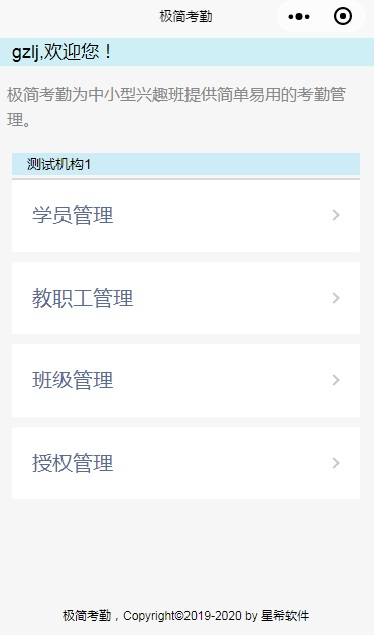

## 插件声明
  本插件为内部开发人员共享，不提供对外服务。
## 添加插件
### 在app.json文件声明插件：
{
  "plugins": {
    "XXZNZJ": { 
      "version": "dev",
      "provider": "wx70358fb44d63c53c"
    }
  }
｝
### 在app.js中初始化插件
const { initPlugin} = requirePlugin("XXZNZJ");
const config = require('config.js');  //宿主应用的配置文件，可以用来修改插件的配置，可为空
App({
    onLaunch: function () {
      //初始化插件，第1个参数为宿主应用app,第2个参数为宿主全局对象wx,第3个参数为修改插件的配置(可为空)
      initPlugin(this, wx, config);
  }
}) 

## 插件功能

### 首页组件 index1
#### 功能描述
index1首页组件，提供如下页的注册界面：

当用户注册完成后，显示如下菜单：

#### 组件使用说明
1、在app.json文件声明使用组件：
{
  "usingComponents": {
    "index": "plugin://XXZNZJ/index1"
  }
}
2、index.wxml文件内容：
<index onloadOptions="{{onLoadOptions}}"  menuList="{{menuList}}" hostUserInfo="{{hostUserInfo}}" phoneNumber="{{phoneNumber}}">
  <view slot='pageDesc'>极简考勤，即二维码考勤，为中小型兴趣班提供简单易用的考勤管理。</view>
  <view slot='getUserInfo'> 
    <button size='mini' type='primary' open-type="getUserInfo"  bindgetuserinfo="onGetUserInfo">微信授权</button>
  </view>
  <view slot='getPhoneNumber'> 
    <button size='mini' type='primary' open-type="getPhoneNumber" bindgetphonenumber="onGetPhoneNumber">点击获取</button>
  </view>
  <view slot='pageFooter'>极简考勤，Copyright©2019-2020 by 星希软件</view>
</index> 
3、组件参数说明
onloadOptions: 传递页面的入口参数到组件内部
menuList: 首页菜单内容
hostUserInfo: 宿主页面中点击“微信授权”，传入宿主应用的用户
phoneNumber: 宿主页面中点击获取微信手机号（如果应用无权限获取手机号，则使用手机短信码注册），传入宿主应用的微信手机号
4、页面中提供有几个slot用于定制首页的其它内容

### 通用数据编辑页面 editdata
#### 功能描述
根据页面定义参数，自动生成数据编辑页面，包括对后台表的存储操作。
